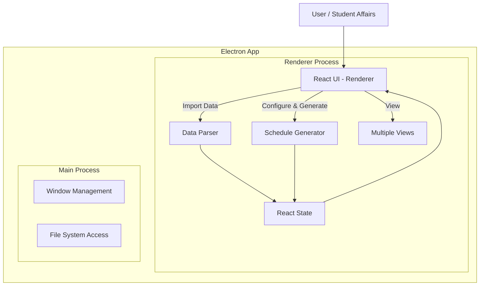

# System Architecture

## Overview
SchedulR is a desktop application built using **Electron**, **React**, and **TypeScript**. It follows a standard Electron architecture with a Main Process handling system-level operations and a Renderer Process handling the UI and business logic.

## High-Level Architecture



## Technology Stack

### Frontend (Renderer Process)
- **Framework**: React 18
- **Language**: TypeScript 5.3+
- **Styling**: TailwindCSS 4.x
- **Internationalization**: i18next, react-i18next
- **State Management**: React Hooks (useState, useEffect)
- **Build Tool**: Vite

### Backend (Main Process)
- **Runtime**: Electron
- **Responsibilities**:
    - Application Lifecycle Management
    - Native Window Management
    - File System Access (via dialog API)
    - IPC (Inter-Process Communication) for native features

### Data Layer
- **Input**: CSV/Text files (Course list, Classroom list, Student attendance)
- **Internal Representation**: TypeScript Interfaces
- **Persistence**: None (Currently in-memory only)

## Component Structure

### Core Components

#### `src/app.tsx`
Main application component managing global state and routing.
- State: `courses`, `classrooms`, `students`, `schedule`
- Routing between views (Dashboard, Data, Schedule, Settings)
- Schedule generation orchestration

#### `src/components/Dashboard.tsx`
Landing page displaying statistics and "Generate Schedule" button.

#### `src/components/DataInput.tsx`
Handles:
- File import (CSV parsing)
- Manual data entry/editing
- Data validation

#### `src/components/ConstraintSelector.tsx`
Modal for configuring schedule generation parameters:
- Start/End dates
- Weekend inclusion
- Daily time range

#### `src/components/ScheduleView.tsx`
Displays generated schedule in multiple views:
- By Classroom
- By Student
- By Course
- By Day

#### `src/components/Settings.tsx`
Application settings (Language selection).

#### `src/components/Sidebar.tsx`
Navigation sidebar.

## Data Flow

1. **Import**: User selects files → `DataInput` parses → Updates `App` state
2. **Generation**: User clicks "Generate" → `ConstraintSelector` modal opens → User configures → `handleFinalizeSchedule` creates schedule → Updates state
3. **Display**: State change triggers re-render → `ScheduleView` displays data

## Current Scheduling Algorithm

**Status**: Simple greedy/round-robin assignment (not constraint-aware)

The current implementation in `app.tsx` uses a basic loop:
- Iterates through courses sequentially
- Assigns classrooms round-robin style (course index % classroom count)
- Places exams in time slots based on configured date range and daily hours
- **Does NOT enforce**: No consecutive exams, Max 2 exams/day per student

## File Structure

```
SE-302-Project/
├── src/
│   ├── components/
│   │   ├── ConstraintSelector.tsx
│   │   ├── Dashboard.tsx
│   │   ├── DataInput.tsx
│   │   ├── ScheduleView.tsx
│   │   ├── Settings.tsx
│   │   └── Sidebar.tsx
│   ├── types/
│   │   └── index.ts
│   ├── constants/
│   │   └── index.ts
│   ├── locales/
│   │   ├── en.json
│   │   └── tr.json
│   ├── app.tsx
│   ├── main.ts
│   ├── renderer.tsx
│   └── i18n.ts
├── specs/
├── docs/
└── package.json
```
